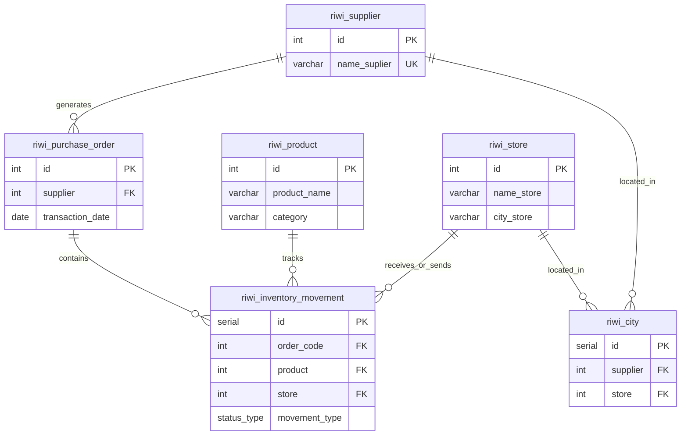

# PruebaDesempe-oBBDD

# Inventory and Supplier Management System (RIWI)

This repository contains the relational database design and structure to manage inventory, stock movements, suppliers, and stores for the organization.

## 📌 Table of Contents
- [Database Architecture](#-database-architecture)
- [Custom Data Types](#-custom-data-types)
- [Data Dictionary](#-data-dictionary)
- [Relationships & Foreign Keys](#-relationships--foreign-keys)

---

## 📊 Database Architecture

The system consists of **6 main tables** and **1 custom enumerated data type (ENUM)** for strict control over inventory states.

---

## ⚙️ Custom Data Types

### `status_type` (ENUM)
Defines the current state or direction of an inventory transaction.
*   `INT`: Stock inbound / entry.
*   `OUT`: Stock outbound / exit.
*   `PENDING`: Transaction on hold (Default value).

---

## 📖 Data Dictionary

### 1. `riwi_supplier`
Stores details about approved commercial suppliers.
*   `id` (INT, PK): Unique identifier for the supplier.
*   `name_suplier` (VARCHAR, UNIQUE): Registered name of the supplier (Cannot be duplicated).

### 2. `riwi_store`
Registers physical retail store locations or branches.
*   `id` (INT, PK): Unique identifier for the store.
*   `name_store` (VARCHAR): Commercial name of the store.
*   `city_store` (VARCHAR): City where the store operates.

### 3. `riwi_product`
The general master catalog of available items.
*   `id` (INT, PK): Unique identifier for the product.
*   `product_name` (VARCHAR): Commercial name of the item.
*   `category` (VARCHAR): Department or category classification.

### 4. `riwi_purchase_order`
Documents procurement transactions made with suppliers.
*   `id` (INT, PK): Purchase order code.
*   `supplier` (INT): Reference code for the associated supplier.
*   `transaction_date` (DATE): Date the order was placed.

### 5. `riwi_inventory_movement`
A detailed history log of all stock entries, exits, and pending statuses across stores.
*   `id` (SERIAL, PK): Auto-incrementing movement log ID.
*   `order_code` (INT, FK): Supporting purchase order for the movement.
*   `product` (INT, FK): The specific item being moved.
*   `store` (INT, FK): The affected retail location.
*   `movement_type` (status_type): Current transaction status (`INT`, `OUT`, `PENDING`).

### 6. `riwi_city`
An intermediary table linking suppliers and stores by regional presence.
*   `id` (SERIAL, PK): Auto-incrementing bridge identifier.
*   `supplier` (INT, FK): Associated supplier reference.
*   `store` (INT, FK): Associated store reference.

---

## 🔗 Relationships & Foreign Keys

*   `riwi_purchase_order(id)` references `riwi_supplier(id)`.
*   `riwi_inventory_movement(order_code)` references `riwi_purchase_order(id)`.
*   `riwi_inventory_movement(product)` references `riwi_product(id)`.
*   `riwi_inventory_movement(store)` references `riwi_store(id)`.
*   `riwi_city(supplier)` references `riwi_supplier(id)`.
*   `riwi_city(store)` references `riwi_store(id)`.

***

⚠️ **Technical Improvement Note:** Check the foreign key on `riwi_purchase_order`. Currently, its primary key `id` references `riwi_supplier(id)`. This forces an unintended 1:1 relationship, limiting you to only one order per supplier. It is highly recommended to change the `FOREIGN KEY` constraint to target the `supplier` column instead.
